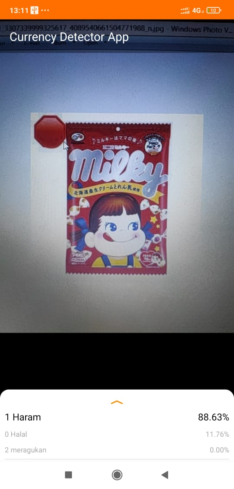
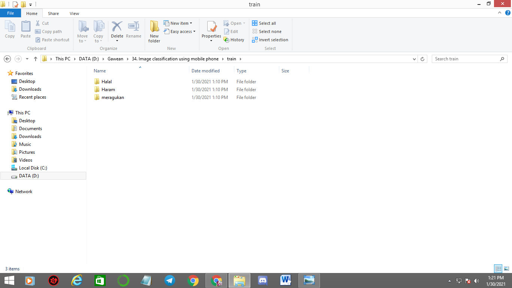
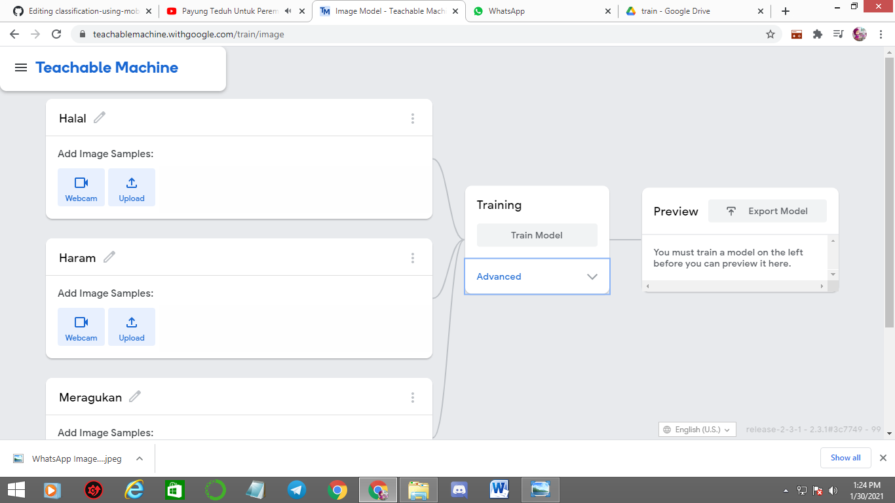
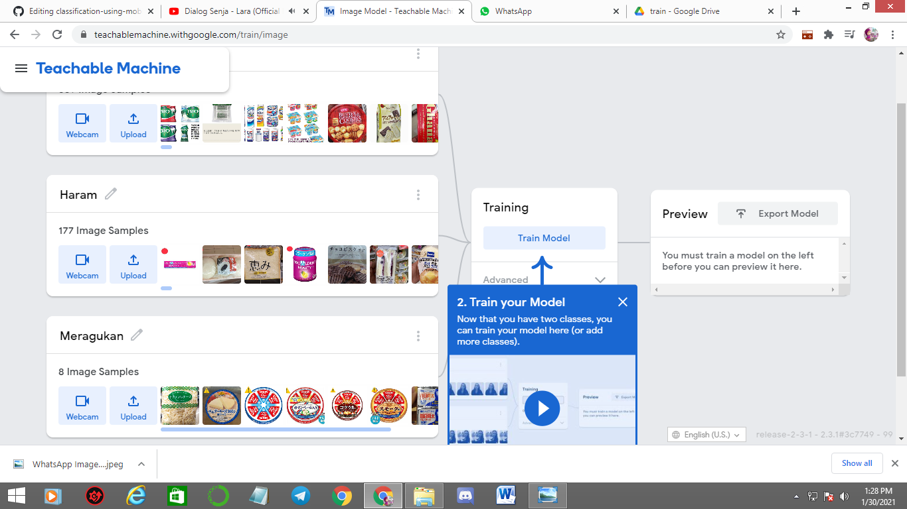
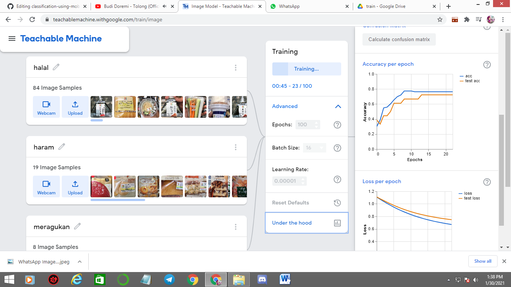
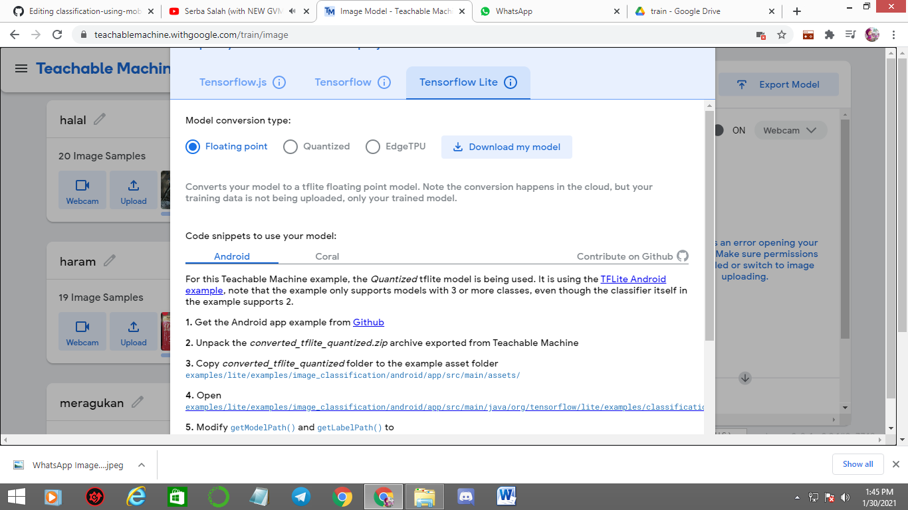
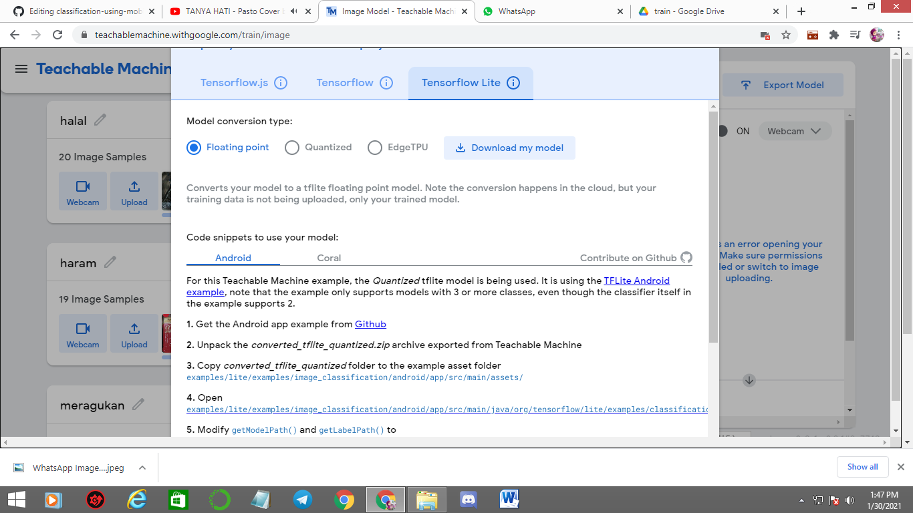
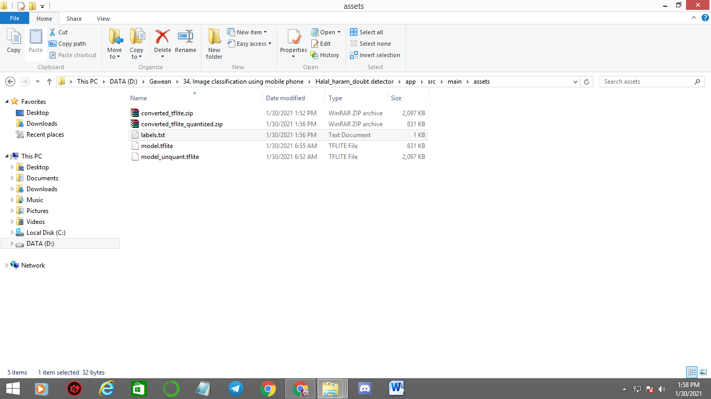

# Classification-using-mobile-phone

This is an implementation of image classification using Teachable machine learning on Python 3, then implement it to mobile phone.

Dataset (Train) : https://drive.google.com/drive/folders/1OZChEqrCwlTKolwT69ExNPnA_CtBkmNo?usp=sharing

The repository includes:
* Using teachable machine learning for image classification 
* Evaluation (confussion matrix) 
* Deploy it to Mobile phone 

# Getting Started
Download this repo and dataset too, if u want use this dataset
* start from making image classification models using teachable machine learning 
* deploy on mobile phone

additional info :
teachable machine is algorithm to make model easy based on web ( https://teachablemachine.withgoogle.com/train/image )

# Training on Your Own Dataset using teachable machine learning

1. Make sure the path like this 

2. Upload all data to google drive ,which one matching with google colab email

3. Open google colab and use this code VGG16_CNN.ipynb, the part u must change just their class 

total lines u must change are 6 

# load model / Testing 

1. Make sure the path like this 

make sure again about Gdrive the important one dataset must be like this

2. Upload all data to google drive ,which one matching with google colab email

3. Open google colab and use this code testing_load_image.ipynb, in this codes  just run all codes 

4. Upload Photo what u want to predict

5. result like this

