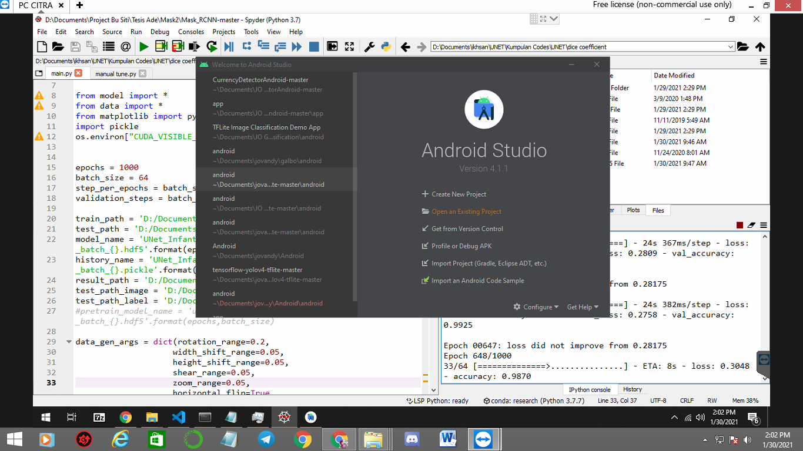
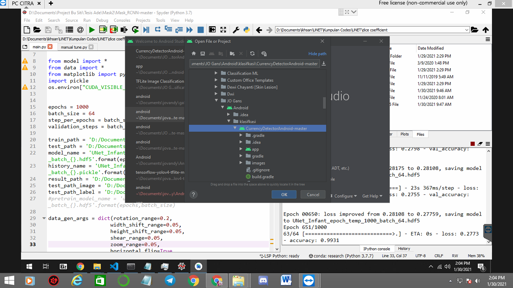
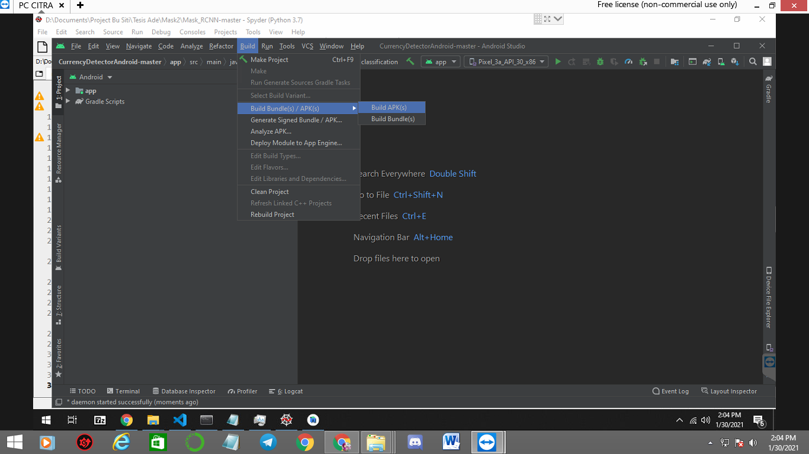
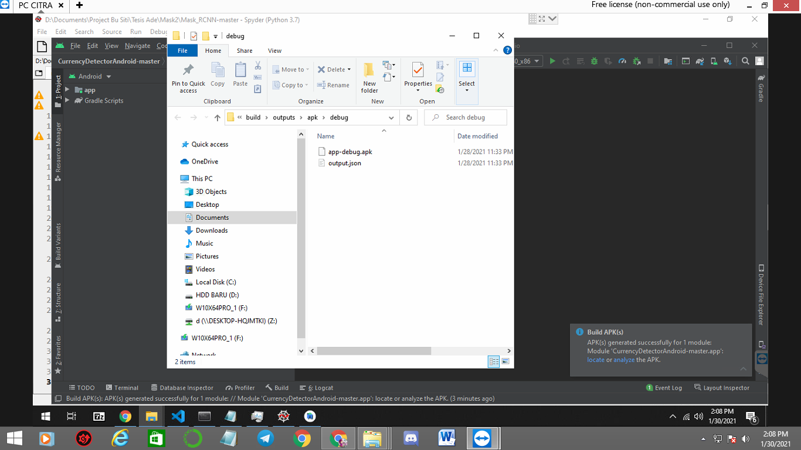

# Classification-using-mobile-phone

This is an implementation of image classification using Teachable machine learning on Python 3, then implement it to mobile phone.

Dataset (Train) : https://drive.google.com/drive/folders/1OZChEqrCwlTKolwT69ExNPnA_CtBkmNo?usp=sharing

The repository includes:
* Using teachable machine learning for image classification 
* Evaluation (confussion matrix) 
* Deploy it to Mobile phone 

# Getting Started
Download this repo and dataset too, if u want use this dataset
* start from making image classification models using teachable machine learning 
* deploy on mobile phone

additional info :
teachable machine is algorithm to make model easy based on web ( https://teachablemachine.withgoogle.com/train/image )

# Training on Your Own Dataset using teachable machine learning

1. Make sure the path like this, and open this link : https://teachablemachine.withgoogle.com/train/image

2. Upload all data to teachable machine, just drag it and drop to upload link 

3. just click train model or u can advance it with ur configuration

4. u can see teh evaluation and ploting, just click "under the hood" 

4. Download 2 model , we need 2 model to deploy it to android

* click export model and go to tensorflow lite mode and download "floating point" and "quantized model" 

# Deploy on android

1. after u download this repo, go to path : "Halal_haram_doubt detector\app\src\main\assets" and put it the download model and extract it

2. download android studio and install it, u can download here : https://developer.android.com/studio?hl=id

3. open android studio and exisiting project 

it will take time for download some gradle 

4.just put the path where u place this repo 

5. go to build - build APK

6. from here u get the app just put it to gdrive and download it (app-debug.apk)

# result 

my app : https://drive.google.com/file/d/10FcIoe8iA3nbuL9WPM2DI2dh5zHsx2XW/view?usp=sharing

